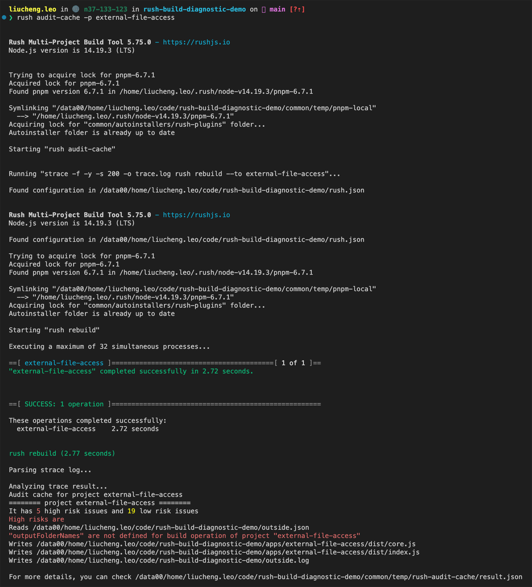

# rush-audit-cache-plugin

A diagnostic tool for rush build cache

# Prerequisite

- Rush.js >= 5.57.0
- strace >= 4.26 in Linux

# Quick Start

1. Enabling this rush plugin

Please follow the [official doc](https://rushjs.io/pages/maintainer/using_rush_plugins/) to enable this plugin in your repo.

2. Running `audit-cache` command

```
rush audit-cache --project <package_name>
```

# Demo

Please check [this demo repo](https://github.com/chengcyber/rush-build-diagnostic-demo)



# Tech Note

[rush audit-cache tech note](./docs/rush-audit-cache-tech-note.md)

# LICENSE

MIT