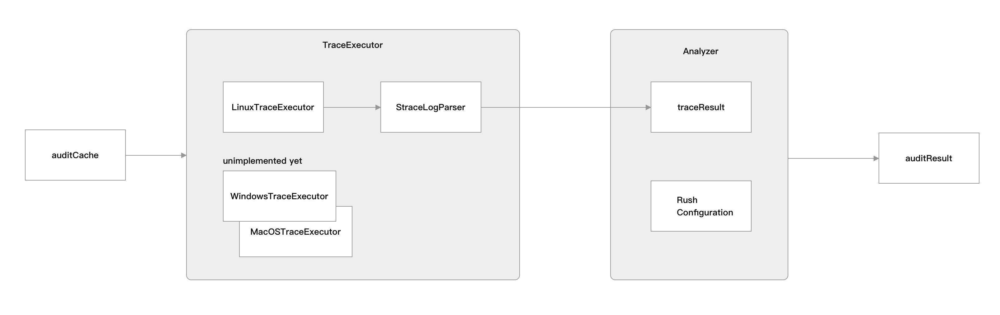

# Rush audit-cache tech note

The **"rush audit-cache"** feature is a diagnostic tool for Rush.js that allows an engineer to monitor the building process of one project. 

Goals:

- When setting up a new project, provide an easy way to validate that the build cache configuration correctly reflects the toolchain's filesystem inputs and outputs
- If an engineer encounters a failure that is suspected to be a cache malfunction, provide an easy way to investigate

Non-goals:

- Continuous monitoring/validation of every build:  In our initial implementation, the analysis may significantly impact build times. The feature will only be available if the OS supports the strace native tool and it has been installed.

During build projects, Rush audit-cache leverages external tools to trace system calls and signals, such as [strace](https://man7.org/linux/man-pages/man1/strace.1.html). This includes file system access for the complete life of building. And then detecting potential issues by analyzing the tracing log.

In our initial proof of concept implementation, use of **rush audit-cache** will require the Linux operating system, because of the dependency on the **strace** tool. This can be changed later by supporting tracing tools for other platforms, such as [dtrace](https://www.brendangregg.com/dtrace.html) in MacOS.

# Design Overview

Rush audit-cache logically consists of the following parts:
- A mechanism for tracing system calls of file access for a process, including forked processes.
- A mechanism for analyzing the trace log to get all inputs and outputs via file system
- A mechanism for reporting issues by comparing project build cache configuration with trace log.

# Design Details

1. Get `TraceExecutor` according to the OS platform. e.g. `LinuxTraceExecutor` for Linux platform.
2. `TraceExecutor` spawns a child process with `strace` command. `strace` will trace all system calls of the child process and its forked processes.
3. `TraceExecutor` reads the trace log from `strace` and parses it to get all file system access events.
4. `Analyzer` analyzes the trace log  with rush project configurations and detects potential issues.

# Reference

- [Proposal for rush build diagnostic tool](./proposal-for-rush-build-diagnostic-tool.md)